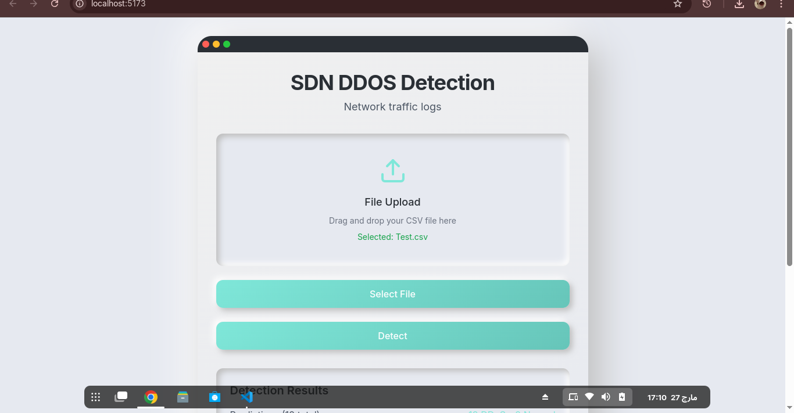

# SDN DDoS Detection System

## 📌 Overview
This project is an AI-powered **DDoS detection system** for **Software-Defined Networks (SDN)**. It uses **Artificial Neural Networks (ANNs)** to classify network traffic as normal or a DDoS attack. The system consists of:
- 🧠 **ANN Model** (Trained using TensorFlow/Keras)
- 🌐 **Flask API** (For real-time detection)
- 🖥 **React Frontend** (For easy CSV file uploads and predictions)

---

## 🏗 Project Structure
```
SDN-DDoS-Detection/
│── backend/                # Flask API (Python)
│   ├── flask_api.py        # Runs the backend API
│   ├── train_ann.py        # Trains ANN model
│   ├── test_request.py     # Sends test requests to API
│   ├── ddos_ann_model.h5   # Saved ANN model
│   ├── scaler.pkl          # Preprocessing (StandardScaler)
│   ├── label_encoder.pkl   # Label encoding for predictions
│── frontend/               # React Frontend (JavaScript)
│   ├── src/
│   │   ├── App.js          # Main React component
│   │   ├── index.js        # Entry point
│   ├── tailwind.config.js  # TailwindCSS settings
│── dataset/                # DDoS Dataset (CSV files)
│── .gitignore              # Ignores unnecessary files
│── README.md               # Project documentation
```

---

## 🚀 Features
✅ **Detects DDoS Attacks** from SDN traffic logs.
✅ **Fast Predictions** using a trained ANN model.
✅ **REST API** for real-time attack detection.
✅ **Web UI** to upload CSV files and get predictions.
✅ **Fully Automated Pipeline** (Train → Deploy → Predict).

---

## 🖥️ Preview
### Home Page  
  

### Detection Results  
 

## 🔧 Installation & Setup
### **1️⃣ Clone the Repository**
```bash
git clone https://github.com/ZainYasir/SDN-DDoS-Detection.git
cd SDN-DDoS-Detection
```

### **2️⃣ Backend Setup (Flask API)**
```bash
cd backend
pip install -r requirements.txt  # Install dependencies
python3 flask_api.py              # Start Flask API
```

### **3️⃣ Frontend Setup (React)**
```bash
cd frontend
npm install  # Install dependencies
npm start    # Start React App (http://localhost:3000)
```

---

## 📊 How to Use
1️⃣ **Train the ANN Model**
```bash
python3 backend/train_ann.py
```
2️⃣ **Start the Flask API**
```bash
python3 backend/flask_api.py
```
3️⃣ **Send Test Predictions (CLI)**
```bash
python3 backend/test_request.py
```
4️⃣ **Use the Web UI** (React App at `http://localhost:3000`)

---

## 🔬 Model Details
- **Algorithm:** Artificial Neural Network (ANN)
- **Dataset:** SDN traffic logs with normal and DDoS attack samples
- **Preprocessing:** Feature scaling, label encoding
- **Training:** TensorFlow/Keras with dropout layers to prevent overfitting

---

## 📜 License
This project is **open-source** under the MIT License.

📌 **Maintainer:** [Zain Yasir](https://github.com/ZainYasir)
